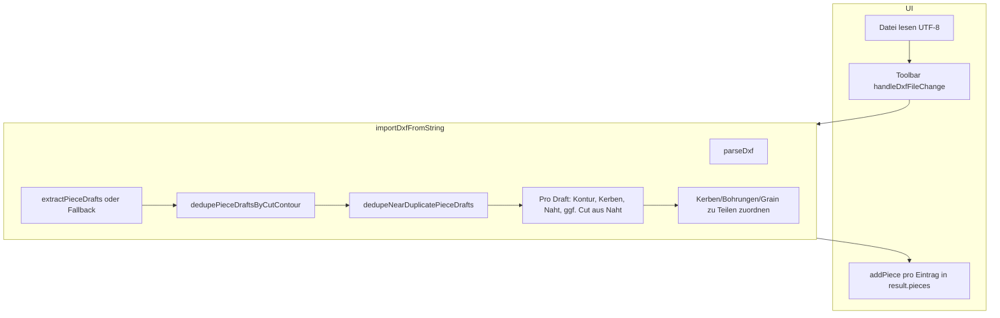

# Bericht: TrimTex DXF-Importlogik und Hypothesen zu doppelten Teilen

**Zweck dieses Dokuments:** Beschreibung des **aktuellen** Ist-Zustands der Importkette (Parser → Teilentwürfe → Konsolidierung → `PatternPiece` → UI), der Rolle von Schnitt- vs. Nahtlinie sowie **verbleibender** Risiken und typischer Problemfälle. Grundlage: `src/dxf/dxfImporter.ts`, `src/dxf/dxfParser.ts`, `src/dxf/dxfImportLayers.ts`, `src/components/Toolbar.tsx`, `docs/DXF-IMPORT-FREMDSYSTEME.md`.

---

## 1. End-to-End-Ablauf (Überblick)

- **UI:** Bei erfolgreichem Import ruft die Toolbar für **jedes** Element von `result.pieces` nacheinander `addPiece(piece)` auf (`src/components/Toolbar.tsx`, ca. Zeilen 296–299). Die Liste `result.pieces` ist zu diesem Zeitpunkt **bereits** nach **exakter** und **naher** Kontur-Konsolidierung gefiltert (siehe unten).
- **Konsolidierung:** Nach `extractPieceDrafts` / `extractFallbackCutDrafts` folgen nacheinander `dedupePieceDraftsByCutContour` (Hash) und `dedupeNearDuplicatePieceDrafts` (einfache geometrische Nähe). Bei Entfernungen jeweils **Warnungen** in `result.warnings` (`src/dxf/dxfImporter.ts`, Import-Hauptpfad nach dem Parsen der Entwürfe).
- **Store:** `addPiece` hängt ein neues Teil an `workspace.pieces` an (`src/store/useStore.ts`, ca. 750–758).

---

## 2. Parser und unterstütztes Format

- **Format:** Minimaler **DXF R12 ASCII**-Leser in `src/dxf/dxfParser.ts`; Binär-DXF wird in `src/dxf/dxfImporter.ts` abgewiesen.
- **`$INSUNITS`:** z. B. `5` = mm, `4` = cm (Koordinaten werden mit Faktor 10 skaliert) — siehe Import und `docs/DXF-IMPORT-FREMDSYSTEME.md`.
- **Entities:** u. a. POLYLINE, LWPOLYLINE (inkl. Bulge-Auflösung), LINE, CIRCLE, POINT, ARC (als tessellierte `ARC_POLYLINE`), optional ELLIPSE/SPLINE als Polylinie; **INSERT** nur in der **ENTITIES**-Hauptsektion, nicht in der Block-internen Slice-Logik (`parseEntitiesFromSlice` listet kein INSERT).
- **Mehrfache ENTITIES-Sektionen:** `parseDxf` iteriert alle `ENTITIES`-Starts und **hängt** alle gefundenen Entities an eine Liste (`src/dxf/dxfParser.ts`, ca. 188–192). Ungewöhnliche DXF-Strukturen könnten theoretisch **doppelte Entity-Listen** erzeugen (Dedupe hilft nur, wenn daraus identische **geschlossene** Schnittkonturen entstehen).

---

## 3. Erkennung von „Schnitt“ vs. „Naht“ (Layer-Heuristik)

Zentral: `src/dxf/dxfImportLayers.ts`.

- **Schnittkontur:** Festes Set `CUT_LAYER_NAMES` (u. a. `CUT`, `1`, `BOUNDARY`, `OUTLINE`, …). **Layer `0` ist weder im Standard-Set noch im Fallback-Kandidaten** — Schnitte auf `0` nur, wenn **`0`** (oder der exakte Layername) unter **Zusätzliche DXF-Schnitt-Layer** eingetragen ist.
- **Nahtlinie:** Set `SEAM_LAYER_NAMES` (u. a. `SEAM`, `14`, `NAHT`, …).
- **Mehrere Entwürfe:** Jede **geschlossene** Polylinie auf einem als Schnitt erkannten Layer kann zunächst ein **eigenes** `PieceDraft` erzeugen.
- **Deduplizierung:** Zuerst **exakt** (Hash-Kanonisierung), danach **nahe** Konturen (Größe/Fläche/Schwerpunkt + BBox-Überlappung). **Reihenfolge der Liste:** zuerst Block-/INSERT-Entwürfe, dann Modellraum — bei Konflikt bleibt der **frühere** Entwurf (BLOCK vor MODELSPACE).

---

## 4. Teilentwürfe (`PieceDraft`) — wo Mehrfach-Teile entstehen können

Die Funktion `extractPieceDrafts` in `src/dxf/dxfImporter.ts` (ca. 381–464) arbeitet in **zwei additiven Phasen**:

### Phase A: `INSERT` → Block-Geometrie

- Für **jedes** `INSERT`-Entity wird der Block (case-insensitive) geladen.
- Im Block werden Polylines nach Layer in `cuts[]` bzw. `seams[]` sortiert.
- **Für jede** Schnitt-Polyline in `cuts` wird **ein** `PieceDraft` erzeugt (`for (const cut of cuts)`).
- Pro Draft wird eine passende Naht gewählt: `pickSeamForCut` (Bounding-Box der Schnittkontur vs. Naht-Polylines; sonst nächstgelegene Naht innerhalb 800 Einheiten).
- **Kerben und Bohrungen** aus dem Block werden **pro INSERT einmal** mit `extractNotchesFromBlock` / `extractDrillsFromBlock` ermittelt; jeder Draft erhält **Kopien** der Arrays (`[...notchesFromLayers]`, `[...drillsFromLayers]`), damit die Block-Parsing-Logik nicht mehrfach dieselbe Schleife pro Schnittlinie ausführen muss. **Fadenlauf** (`extractGrainFromBlock`) bleibt **pro Schnittkontur** sinnvoll, da die Bounding-Box der jeweiligen `cut` einfließt.

### Phase B: Modellraum ohne INSERT

- Alle Entities **außer** `INSERT`: Polylines auf Schnitt-Layer → `cutsFlat`; auf Naht-Layer → `seamsFlat`.
- **Eine Draft pro Schnitt-Polyline** in `cutsFlat`, mit `pickSeamForCut` gegen `seamsFlat`.

**Block + Modellraum:** Phase A und Phase B schreiben nacheinander in dieselbe `drafts`-Liste. Anschließend (in `importDxfFromString`) laufen Hash-Dedupe und Near-Dedupe; bei Bedarf **zwei** getrennte Warnungen.

Weitere **weiterhin mögliche** Mehrfach-Teile (Near-Kriterien nicht erfüllt):

- **Mehrere** `INSERT` desselben Blocks an verschiedenen Positionen → mehrere Teile (meist gewollt).
- **Mehrere** geschlossene Schnitt-Polylines in **einem** Block mit **unterschiedlicher** Geometrie → mehrere `PatternPiece`.
- **Zwei** Polylines, die sich **stärker** unterscheiden als die Near-Schwellen (z. B. größerer Abstand der Schwerpunkte, andere Fläche/BBox-Überlappung) → **zwei** Teile; bewusst konservativ, um Über-Deduplizierung zu vermeiden.

---

## 5. Fallback, wenn keine Schnitt-Layer passen

`extractFallbackCutDrafts` (`src/dxf/dxfImporter.ts`, ca. 470–520) wird nur genutzt, wenn `extractPieceDrafts` **leer** zurückkommt.

- Sammelt geschlossene Polylines (Fläche ≥ 2) auf Layern, die **nicht** in `isExcludedLayerFallback` liegen — dazu zählen u. a. Naht-, Kerben-, Bohrer-, Grain-Layer, typische Hilfs-/Text-Layer-Namen und **`0`** (explizit ausgeschlossen, um Hilfs-Umrisse zu vermeiden).
- Sortiert nach **Fläche** (groß nach klein), max. 80 Stück.
- **Kein** gleichzeitiger Lauf mit der Hauptextraktion: entweder Hauptpfad **oder** Fallback, nicht beides.
- Auch hier gelten die finalen Entwürfe erst nach der **gemeinsamen** Dedupe-Phase in `importDxfFromString`.

---

## 6. Von Draft zu `PatternPiece`: Kerben, Schnitt, Naht, Option „Naht beim Import“

Schleife in `importDxfFromString` (`src/dxf/dxfImporter.ts`, Hauptbearbeitung der Entwürfe ca. ab Zeile 786):

1. **Geschlossenheit:** Mindestens 3 Punkte; Kontur muss nach Bereinigung geschlossen sein (`closed` oder `isClosed` mit Schwellwert `DUPLICATE_THRESHOLD = 0.01`).
2. **V-Kerben in der Polylinie:** optional mehrstufige Toleranz (`detectNotchesWithToleranceFallback`); Ergebnis kann **Eckpunkte der Kontur verändern** (`cleanedVertices`).
3. **`cutLine`:** aus `cleanedVertices` als Folge von Liniensegmenten (`verticesToCurves`); sehr kurze Segmente (< 0.01) werden verworfen.
4. **Naht aus DXF:** Wenn `seamVertices` vorhanden und `estimateSeamAllowanceMm` + mindestens drei Naht-Segmente sinnvoll sind, werden `seamLine` und `seamAllowanceMm` gesetzt.
5. **Option `createSeamLineOnImport`:** Wenn **keine** brauchbare Naht aus der DXF kommt, aber die Einstellung aktiv und `importSeamAllowanceMm` > 0: Innenoffset (`offsetCurvesInwardForSeam`) und ggf. **Neu-Ableitung der Schnittkontur** aus der Naht (`deriveCutLineFromSeamWithValidation`) — mit Warnungen bei Abweichung oder fehlgeschlagenem Roundtrip.
6. **Kerben:** Layer-Kerben + geometrische Kerben; anschließend `resyncNotchesAfterCutLineRebuilt`, falls sich die Schnittlinie gegenüber dem ursprünglichen Import geändert hat.

**Hinweis:** Die Option „Naht beim Import erzeugen“ betrifft die **Geometrie eines einzelnen** Teils, nicht die **Anzahl** der Teile. Zusätzliche Teile entstehen typischerweise durch **mehrere unterscheidbare Entwürfe** oder durch **keine** Deduplizierung bei nur **ähnlicher** (nicht identisch gehashter) Kontur.

---

## 7. Nachträgliche Zuordnung (Modellraum)

Nach Erzeugung aller Teile werden **nur Modellraum-Entities** (nicht Block-Inhalt) für Kerben, Bohrungen und Grain per Bounding-Box-Heuristik den Teilen zugeordnet (`extractStandaloneNotches` / `extractStandaloneDrills` / `extractStandaloneGrain` mit `assignToPiece` und 50er-Toleranz).

---

## 8. Hypothesen-Checkliste: „Warum sehen wir (noch) doppelte oder falsche Teile?“

| Hypothese | Aktuelles Verhalten / Mechanismus | Was in der DXF / Einstellungen prüfen |
| --- | --- | --- |
| **Block + Modellraum, gleiche Kontur** | Zwei Entwürfe → **ein** Teil nach Hash-Dedupe; Warnung möglich | Explodierte Kopie + `INSERT` mit identischer Geometrie |
| **Block + Modellraum, minimal verschoben** | Zwei Entwürfe → oft **ein** Teil nach Near-Dedupe (±2 %, hohe BBox-Überlappung, nahe Schwerpunkte); eigene Warnung | Kleine Verschiebungen / Export-Rundung |
| **Mehrere Schnitt-Polylines** | Ein Entwurf pro Polyline; Dedupe nur bei **identischer** Kanonisierung | Innenkonturen, Hilfsumrisse auf Schnitt-Layern |
| **Layer `0`** | Weder Standard-Schnitt noch Fallback-Kontur; **extraCutLayers** z. B. `0` | Alles auf AutoCAD-Layer `0` ohne Anpassung in TrimTex |
| **Zusätzliche Schnitt-Layer** | `extraCutLayers` erweitert die Treffer | Derselbe Umriss auf zwei explizit konfigurierten Layern → zwei Teile, sofern Geometrie nicht bitgleich |
| **Mehrere INSERT** | Pro INSERT × Anzahl Schnitt-Polylines im Block | Mehrfaches Platzieren (oft gewollt) |
| **Mehrfache ENTITIES** | Parser hängt Listen an; Dedupe nur bei identischen **Schnitt**-Konturen | Ungewöhnlicher Export |
| **Kein Zusammenhang Naht/Schnitt** | `pickSeamForCut` per Bounding-Box/Abstand; **kein** zusätzliches Teil | Qualität der Naht-Zuordnung |

---

## 9. Was TrimTex **noch nicht** tut (Grenzen — relevant für Beratung)

- **Keine** Zusammenführung **spiegelbildlicher** oder **topologisch nur ähnlicher** Konturen; Near-Match ist bewusst **eng** (Größe/Fläche/Schwerpunkt + BBox-Überlappung), kein allgemeines „Shape Matching“.
- **Kein** verschachteltes **INSERT innerhalb von BLOCK-Definitionen** in der Block-Parsing-Slice (nur direkte Entities im Block).
- Erweiterte DXF-Features nur teilweise; ignorierte Entity-Typen erzeugen Warnungen (`scanUnsupportedEntityHints`).
- **Keine** CAD-spezifischen Import-Profile (Lectra/Gerber/…); Layer-Listen bleiben generisch erweiterbar über `extraCutLayers`.

---

## 10. Technische Kurzreferenz Dedupe (für Gutachter)

- **Exakt:** `canonicalCutContourKey`, `dedupePieceDraftsByCutContour` (`src/dxf/dxfImporter.ts`, Hash-Rundung `CONTOUR_HASH_DECIMALS`).
- **Near-Match:** `closedRingPointsRaw`, `areNearDuplicateCuts`, `dedupeNearDuplicatePieceDrafts` — Schwellen `NEAR_DUPE_REL_TOL` (2 %), `NEAR_DUPE_BBOX_OVERLAP_MIN` (72 % der kleineren Box-Fläche), Mindestfläche `NEAR_DUPE_MIN_AREA_MM2`.
- **Quelle:** Jeder `PieceDraft` trägt `importSource`: `block` | `modelspace` | `fallback` (für Nachvollziehbarkeit; die effektive Priorität BLOCK vor Modellraum folgt aus der **Reihenfolge** der Entwürfe nach `extractPieceDrafts`).
- Geschlossenheit für den Hash: Flag `closed` **oder** nahe beieinander liegender erster/letzter Punkt (`DUPLICATE_THRESHOLD`).
- Offene oder zu kurze Konturen: **kein** Hash-/Near-Vergleich in der gleichen Form → Entwurf wird nicht per Kontur-Dedupe zusammengelegt.

---

## 11. Empfohlene Informationen an externe Beratung / Support

1. **Beispiel-DXF** plus Screenshot, wenn weiterhin unerwartete Teileanzahl.
2. **Exporteinstellungen** (R12 ASCII, Layer-Namen).
3. Ob **INSERT** und parallele **Modellraum**-Polylines vorkommen und ob Koordinaten exakt übereinstimmen.
4. TrimTex-**Einstellungen**: `dxfImportCreateSeamLine`, `importSeamAllowanceMm`, **`extraCutLayers`** (v. a. bei Nutzung von Layer `0`), `importScale`.
5. **`result.warnings`** nach Import (Dedupe-Hinweis, Kerb-Toleranz, Naht-Roundtrip, …).

---

## 12. Referenz auf interne Doku/Tests

- Fremdsystem-Hinweise: `docs/DXF-IMPORT-FREMDSYSTEME.md`
- Spezifikation (Kerben etc.): `docs/DXF-MASTER-SPEZIFIKATION.txt`
- Regressionstests (u. a. Dedupe, Layer `0`): `src/dxf/dxfImport.test.ts`

---

**Hinweis:** Umgesetzt u. a.: Hash-Dedupe, **Near-Duplicate**-Stufe (einfache geometrische Kriterien), strengere Layer-`0`-Policy, effizientere Block-Kerben/Bohrer-Ermittlung, klarere Warnungen und `importSource` auf Entwürfen. Offen bleiben u. a. rekursive INSERTs in Blöcken, CAD-spezifische Layer-Profile und konfigurierbare Toleranzen — dort lohnt weiterhin fachliche Beratung oder Priorisierung.

---

## 13. Lesbarkeit, Zielgruppe und „Apple-Stil“ (Bedienbarkeit der **Doku**, nicht der App)

**Kurzantwort:** Dieser Bericht ist **nicht** im Sinne von Apple Human Interface Guidelines „einfach und verständlich“ für breite Nutzerinnen — er ist **fachlich dicht**, referenziert Codepfade und ist für **technische Abstimmung** (Support, CAD-Ansprechpartner, Gutachter) gedacht. Das ist für diesen Zweck **konsistent**, aber die **Erwartung** („eine Seite, alles klar“) sollte aktiv gesetzt werden.

### Was gut an „Klarheit“ erinnert (positiv)

- **Klare Gliederung** (nummerierte Kapitel, Mermaid-Überblick, Checkliste in Abschnitt 8).
- **Konkrete Handlungshinweise** in Abschnitt 11 (was man nachreichen soll).
- **Grenzen** explizit benannt (Abschnitt 9) — reduziert falsche Annahmen.

### Wo es eher **kompliziert** wirkt (verbesserungsfähig)

- **Viele Implementierungsdetails** (Dateinamen, Funktionsnamen, Zeilenangaben) ohne vorangestellte **Ein-Satz-Zusammenfassung** pro Abschnitt — typische Leserin springt zwischen Detail und Bedeutung.
- **Fachbegriffe ohne Mini-Glossar** (`PieceDraft`, `Near-Dedupe`, `importSource`, `result.warnings`) — für CAD-affine, aber nicht programmierende Leserinnen ist das eine Hürde.
- **Mermaid-Diagramm** ist hilfreich, setzt aber Vertrauen in „Parser → … → UI“ voraus; eine **rein sprachliche** 3-Schritte-Kurzfassung („1. DXF lesen … 2. Teile erkennen … 3. in die Arbeitsfläche legen“) wäre näher an vereinfachendem Stil.

### Inkonsistenzen und Überschneidungen mit anderer Doku

| Thema | In diesem Bericht | In `docs/DXF-IMPORT-FREMDSYSTEME.md` | Hinweis |
| --- | --- | --- | --- |
| Unterstütztes Format / `$INSUNITS` | Abschnitt 2, knapp | Abschnitt „Unterstütztes Format“ | Inhalt **überlappt**; Formulierungen leicht unterschiedlich — Risiko, dass sich Zahlen/Formulierungen bei Änderungen **auseinanderlaufen**. |
| Dedupe (Hash + Near) | Abschnitte 1, 4, 10 | Abschnitt „Deduplizierung“ | Gleiche Story, **unterschiedliche Tiefe**; hier mehr Zahlen/Schwellen, dort kompakter. |
| Warnungen nach Import | `result.warnings` (technisch) | „Hinweise in `result.warnings`“ / „Hinweiszeile“ | **Begrifflich nicht einheitlich** (API-Name vs. Nutzerbegriff „Hinweis nach Import“). |
| Layer `0` | mehrfach, mit `extraCutLayers` | Tabelle + Hinweis in Dedupe | Inhalt stimmig, **Ton** im Fremdsystem-Dok kürzer. |

### Konkrete Verbesserungen (ohne den technischen Kern zu verwässern)

1. **Oben eine Zielgruppen-Zeile** ergänzen oder beibehalten: „Für Endanwender: zuerst `DXF-IMPORT-FREMDSYSTEME.md`; dieser Bericht für Importlogik und Grenzfälle.“
2. **Pro Hauptabschnitt (2–7) eine erste Zeile in Alltagssprache**, danach der technische Block — entspricht eher der Apple-Idee „progressive disclosure“.
3. **Mini-Glossar** (½ Seite) für `PieceDraft`, Dedupe-Stufen, `importSource` — einmalig pflegen und von `FREMDSYSTEME.md` verlinken statt doppelt zu erklären.
4. **Single source of truth** für Tabellen/Limits (z. B. Near-Dedupe-Prozente): entweder nur hier **oder** nur in der Spez/Test-Doku verankern und andernorts verlinken.

Damit bleibt der Bericht **korrekt und tief**, wird aber für Mischpublikum **weniger kognitiv belastend** und die Doku-**Inkonsistenzen** zwischen den beiden DXF-MD-Dateien werden bewusst adressiert.
