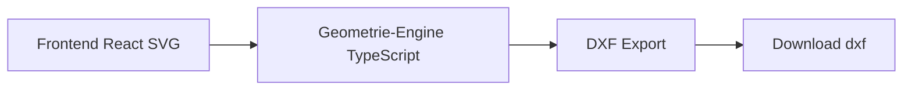

# Spezifikation Phase 1 – TrimTex (2D Pattern Software)

Konsolidierte Spezifikation für die webbasierte 2D-Software für Automotive-Schnittteile (z. B. Autositzbezüge). Einheitliches Datenmodell, keine Redundanzen.

---

## 1. Ziel und Scope Phase 1

**Ziel:** Schnell lauffähige webbasierte 2D-Software für Automotive-Schnittteile (Autositzbezüge).

**Enthalten:**
- Zeichnen von Schnittteilen
- Mehrere Teile auf einer Arbeitsfläche, unabhängig bearbeitbar
- Jedes Teil hat eine eindeutige ID und eine eindeutige Teilnummer (für Produktion)
- Notches setzen
- Nahtzugabe (Offset)
- Layer-System
- DXF-Export (produktionstauglich, einfache Layer-Variante)

**Nicht enthalten (Phase 1):**
- Parametrik
- 3D
- Komplexe Simulation

---

## 2. Architektur

```
Frontend (React + SVG)
         ↓
Geometrie-Engine (TypeScript Core)
         ↓
DXF-Export-Modul
         ↓
Download .dxf
```

- **SVG** dient nur zum Rendering.
- Alle echten Daten liegen in einer **eigenen Geometriestruktur (JSON)**.
- **Workspace** verwaltet mehrere PatternPieces gleichzeitig.



---

## 3. Tech Stack

**Frontend**
- React
- TypeScript
- Vite (Build Tool)
- Zustand (State Management)

**Rendering**
- Reines SVG
- Kein Canvas
- Kein schweres Framework

**Geometrie / Mathe**
- bezier-js (Kurvenberechnung)
- clipper-lib (Offset für Polylines)
- Eigene Wrapper für Double Precision

**DXF-Export**
- Eigener minimaler DXF R12 Writer (kein schweres npm-Paket)

**Warum kein fertiger DXF-Writer?**  
Volle Kontrolle über Layer und Produktionslogik.

---

## 4. Datenmodell (eindeutig)

Es wird **nicht** SVG gespeichert. Alle Koordinaten sind `number` (Double Precision), Einheit **mm**.

```ts
type Workspace = {
  id: string
  name: string
  pieces: PatternPiece[]
  view: {
    zoom: number
    panX: number
    panY: number
  }
}

type PatternPiece = {
  id: string              // interne eindeutige ID
  number: string         // eindeutige Teilnummer für Produktion
  name: string
  cutLine: Curve[]
  seamLine?: Curve[]
  notches: Notch[]
  drills: Drill[]
  grainLine?: Line
  internalLines: Curve[]
  layer: string
  transform: {
    x: number
    y: number
    rotation: number     // in Grad
    mirrored: boolean
  }
}

type Notch = {
  id: string
  position: Point
  angle: number
  type: "single" | "double" | "v"
  depth: number
}
```

Weitere Typen (Point, Curve, Line, Drill) sind in der Geometrie-Engine zu definieren; Einheit durchgängig mm.

---

## 5. Feature Scope (MVP)

**Zeichenfunktionen**
- Linie
- Bézier-Kurve
- Punkt verschieben
- Geschlossene Form erkennen

**Bearbeitung einzelner Teile**
- Offset (Nahtzugabe)
- Spiegeln
- Drehen
- Kopieren
- Verschieben von ganzen Teilen auf der Arbeitsfläche
- Auswahl mehrerer Teile (Mehrfachauswahl)

**Produktionsfeatures**
- Notch setzen (an Kurve mit Winkel)
- Drill Hole setzen
- Layer auswählen (CUT, SEAM, NOTCH, DRILL, GRAIN, TEXT)

**Export**
- DXF R12
- Layer-basiert
- Cutline als POLYLINE (R12-konform)
- Notches als LINE Entities
- Drill als CIRCLE

---

## 6. Workspace: Konzept, Rendering, Interaktion

### Konzept

- Zentrale **Arbeitsfläche** für alle Teile (CAD-ähnlicher Viewport).
- Mehrere **PatternPieces** gleichzeitig sichtbar und bearbeitbar.
- Jedes Teil hat eine **eindeutige Teilnummer** für die Produktion.
- Zoom, Pan, Grid optional wie in CAD.

### Rendering (React + SVG)

- Jedes Teil als `<g>` gruppiert:
  - `<path>` für CutLine, SeamLine
  - `<line>` für Notches
  - `<circle>` für Drills
- Workspace-Transformation über übergeordnetes `<g>` (translate/scale) für Zoom und Pan.
- Vorteile: Interaktivität pro Teil, performant für 2D, keine Canvas-Komplexität.

### Interaktion

- **Selektion:** Klick auf ein Teil → Highlight/Bounding Box; Shift+Klick → Mehrfachauswahl.
- **Transformation:** Drag zum Verschieben; Handles für Drehen, Spiegeln, Kopieren.
- **Layer-Zuordnung:** CUT, SEAM, NOTCH, DRILL pro Teil bzw. global steuerbar.
- **Teilnummer:** Sichtbar im UI, bleibt dem Teil zugeordnet → DXF-Export bleibt korrekt.

### Export-Hinweis

Der DXF-Writer iteriert über alle Teile im Workspace. Es werden nur die **Teil-Geometrien** exportiert (Layer, Polylines, Notches, Drills). Das **Workspace-Layout** (Position/Rotation der Teile auf der Fläche) wird nicht in die DXF-Datei übernommen.

---

## 7. Export (DXF)

### Layer-Standard (Phase 1, einfach)

- CUT
- SEAM
- NOTCH
- DRILL
- GRAIN
- TEXT

**Phase 2 (Ausblick):** AAMA-konforme Layer-Bezeichnungen.

### Entity-Mapping

| Quelle        | DXF R12 Entity |
|---------------|----------------|
| CutLine       | POLYLINE       |
| Notches       | LINE           |
| Drills        | CIRCLE         |

Workspace-Layout (Pan/Zoom/Anordnung der Teile) wird nicht exportiert; nur die geometrischen Daten der Teile.

---

## 8. Technische Regeln

- SVG nur für das Rendering verwenden.
- Geometrie **niemals** aus SVG zurücklesen.
- Offsets nur auf stabilisierten Kurven anwenden.
- Notches als eigene Objekte im Datenmodell führen.
- Einheit durchgängig **mm**.
- Kein Float-Rounding im UI.

---

## 9. Phasen

**Phase 1 (4–8 Wochen)**  
SVG-Editor, Punkte und ganze Teile verschieben, geschlossene Polylines, Offset/Nahtzugabe, DXF-Export, Notches. Ziel: produktionsfähig für einfache Automotive-Schnittteile.

**Phase 2 (Ausblick)**  
Saubere AAMA-Codierung, Piece-Metadaten, Block-Struktur, Marker-Integration.

---

## 10. Ergebnis Phase 1 (Checkliste)

Nach Phase 1:

- Webbasierte 2D-Pattern-Software
- Mehrere Schnittteile auf einer Arbeitsfläche
- Eindeutige Teilnummern pro Teil
- Notch-System
- Nahtzugabe (Offset)
- DXF-Export
- Produktionsfähig für einfache Automotive-Schnittteile

---

*Dokument: konsolidierte Spec ohne Redundanzen, Stand Phase 1.*
