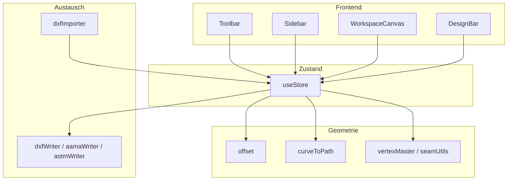

# TrimTex – Software-Dokumentation

**Version:** 0.0.6 (Stand laut `package.json`)  
**Format:** Markdown (technisches Handbuch zur bestehenden Anwendung)

TrimTex ist eine **webbasierte 2D-Pattern-Software** für Schnittmuster (z. B. Automotive-Textilien). Die Geometrie wird in einem eigenen Datenmodell in **Millimetern** geführt; **SVG** dient ausschließlich der Darstellung und Interaktion – die „Wahrheit“ liegt nicht im DOM, sondern im Store.

---

## 1. Ziel und Einsatzbereich

- Zeichnen und Bearbeiten von **Schnittteilen** mit Außenkontur (**cutLine**), optional **Nahtlinie** (**seamLine**) bei Nahtzugabe.
- Mehrere Teile auf einer **Arbeitsfläche** (Workspace), jeweils mit **ID** und **Teilnummer** für die Produktion.
- **Kerben (Notches)**, **Bohrungen (Drills)**, **Laufrichtung (Grain)**, **interne Hilfslinien**.
- **DXF-Export** (einfacher R12-Writer sowie Varianten Richtung **AAMA** / **ASTM**), **DXF-Import** zum Einlesen von Konturen.
- Langfristiges Projektziel: Exportformate, die mit **AAMA-DXF** und **ASTM-DXF** kompatibel werden (siehe Projektregeln und `docs/ZIELFORMATE-AAMA-ASTM.md`).

---

## 2. Technologie-Stack und Frameworks

| Bereich | Technologie | Rolle |
|--------|-------------|--------|
| UI | **React 18** | Komponenten, Hooks, Modale, Menüs |
| Build | **Vite 5** | Dev-Server, Bundling; `base: '/trimcad1/'` für Deployment-Pfad |
| Sprache | **TypeScript** | Typsicheres Datenmodell und Geometrie |
| State | **Zustand** | Zentraler Store (`src/store/useStore.ts`) |
| Rendering | **SVG** | Pfade, Linien, Kreise; Zoom/Pan auf Container-Ebene |
| Kurven | **bezier-js** | Bézier-Mathematik (Teilen, Zusammenführen, Punkt auf Kurve) |
| Offset | **clipper-lib** | Robuste Offsets für Polylines (Nahtzugabe / Schnittkontur) |

**Abhängigkeiten:** keine UI-Frameworks wie MUI; Styling über **`src/index.css`**.

---

## 3. Architektur (Art und Weise der Software)

```
Benutzer → React-Komponenten (Toolbar, Sidebar, WorkspaceCanvas, …)
                ↓ liest/schreibt
          Zustand-Store (Workspace, Teile, Werkzeug, Ansichtsoptionen)
                ↓ ruft auf
          Geometrie-Module (offset, Kurven, Naht, Notches, …)
                ↓ bei Export
          DXF-Writer / AAMA- / ASTM-Writer, DXF-Importer
```

- **Single Page Application:** Einstieg `src/main.tsx` → `App.tsx`.
- **WorkspaceCanvas** kapselt den Großteil der Maus-/Tastatur-Logik (Werkzeuge, Selektion, Drag).
- **Geometrie** ist in `src/geometry/` gekapselt; der Store orchestriert Updates (z. B. nach Vertex-Zug: Nahtlinie neu berechnen, Notches synchronisieren).



---

## 4. Benutzeroberfläche

### 4.1 Layout (`App.tsx`)

- **Toolbar** oben: Menüs (Datei, Erzeugen, Bearbeiten, Naht, …), Werkzeuge, Export/Import, Hilfe.
- **Sidebar** links: Teileliste, Teil hinzufügen/löschen, Teilnummer/Name, Hinweis auf Nahtzugabe.
- **WorkspaceCanvas** (Hauptbereich): Zeichenfläche mit Zoom/Pan, Raster, Teile als SVG-Gruppen.
- **DesignBar** unten: Schalter für Raster, Punkte, Laufrichtung, Kerben, Bohrungen, interne Linien, Teilnamen, Konturmaße.
- **Modale:** Hilfe, Tastenkürzel, Teileigenschaften (Name, Flächenfüllung), Einstellungen, Naht-Anpassung (Kerben).

### 4.2 Werkzeuge (über Store `tool`)

| Werkzeug | Kurzbeschreibung |
|----------|------------------|
| `select` | Auswahl von Teilen und Editierpunkten |
| `pan` | Arbeitsfläche verschieben |
| `line` / `bezier` | Kontur-Segmente zeichnen |
| `rectangle` | Rechteck-Kontur |
| `point` / `curvepoint` | Vertex einfügen bzw. Punkt auf Bézier verschieben |
| `notch` | Kerbe setzen |
| `drill` | Bohrung setzen |
| `internalLine` / `internalCircle` | Hilfsgeometrie innerhalb des Teils |
| `kante` | Kantenbezogene Bearbeitung |
| `digitize` | Digitalisieren (Knotenkette mit optionalen Tangenten) |

Die genaue Interaktion (Klick, Drag, Toleranzen) ist in **`WorkspaceCanvas.tsx`** implementiert; der Store liefert die Aktionen (`addCurveToCutLine`, `updateVertex`, …).

---

## 5. Datenmodell (`src/types/model.ts`)

Alle Koordinaten sind **`number` in mm**.

- **`Workspace`:** `pieces[]`, `view` (Zoom, Pan), `seamAssignments[]` (Nahtzuordnung nur für die **Ansicht**, nicht für den einfachen DXF-R12-Export der Hauptkontur).
- **`PatternPiece`:** `id`, `number`, `name`, `cutLine`, `seamLine`, `seamAllowanceMm`, `notches`, `drills`, `grainLine`, `internalLines`, `layer`, `transform` (x, y, Rotation°, Spiegelung, optional `pivotLocal`), `softVertices`, `fillInterior`.
- **`Curve`:** `line` oder `bezier` (jeweils Start/Ende, bei Bézier zwei Kontrollpunkte).
- **`Notch`:** `position`, `angle`, `type` (single/double/v), `depth`, optional `width`, optional `vertexIndex` (Verankerung am Konturpunkt).
- **`DigitizeState` / `DigitizeNode`:** Knoten mit optionalem `handleOut` für glatte Übergänge; Abschluss erzeugt geschlossene `Curve[]`.

---

## 6. Zentrale Funktionsweisen

### 6.1 Seam-as-Master (Nahtzugabe)

**Prinzip:** Ist `seamAllowanceMm` gesetzt und eine gültige Nahtlinie vorhanden, ist die **Innenkontur (seamLine)** die bearbeitbare Hauptkontur. Die **Außenkontur (cutLine)** wird per **Offset nach außen** aus der Nahtlinie abgeleitet (siehe `deriveCutLineFromSeamWithValidation` / `offsetCurvesOutwardForCut` in `geometry/offset.ts`).

**Ohne Nahtzugabe:** `cutLine` ist Master; `seamLine` kann leer sein.

**Vertex-Bearbeitung:** Standard bei Nahtzugabe: **seamLine** wird editiert, danach wird `cutLine` neu abgeleitet. **`useSeamLineForVertexEditing`** (in `vertexMaster.ts`) und **`getCurvesForSeamEdge`** / **`getEditingContour`** (in `seamUtils.ts`) nutzen **dieselbe** Master-Entscheid: `seamAllowanceMm` gesetzt und `seamLine.length >= 3` → Bearbeitungs- und SeamAssignment-Indizes beziehen sich auf **seamLine**; sonst auf **cutLine**. Es gibt keine zusätzliche Bedingung über `cutLine.length` (die Außenkontur ist abgeleitet). **Punkt-/Kurvenpunkt-Werkzeug** folgt **`useSeamLineForPointCurveEditing`** (identische Bedingung wie Eckpunkte).

**Mittelfristig (optional):** Historische Namen wie `insertPointOnCutLine` können in `insertPointOnContour` o. Ä. umbenannt werden, ohne die Logik zu ändern — reine Lesbarkeit.

#### Harte Regeln: Beziehung `seamLine` ↔ `cutLine` (Segmente, IDs, Zuordnung)

Diese Regeln sind für **Notches**, **SeamAssignment** und jede Erweiterung am Offset relevant:

1. **Neuberechnung der Schnittkontur:** Sobald bei aktiver Nahtzugabe die Außenkontur aus der Naht abgeleitet wird, ist **`cutLine` das komplette Ergebnis des Offsets** (Clipper → überwiegend kurze **Liniensegmente**). Es gibt **keine** teilweise Wiederverwendung früherer `cutLine`-Segmente und **keine** stabile 1:1-Segment-ID zwischen einem `seamLine[i]` und einem `cutLine[j]`.

2. **Kein Segment-Mapping Naht → Schnitt:** Zwischen Naht- und Schnittkontur besteht **keine** persistente ID- oder Index-Zuordnung auf Segmentebene. Die Segmentanzahl unterscheidet sich typischerweise stark (Bézier/Naht vs. abgetastete Polyline der Schnittkontur).

3. **SeamAssignment (`curveIndicesA` / `curveIndicesB`, `clickedCurve*`):** Indizes beziehen sich **immer** auf die **Master-Kontur** in der Reihenfolge von **`getCurvesForSeamEdge`** (`seamUtils.ts`): bei gesetzter Nahtzugabe und gültiger `seamLine` auf **`seamLine`**, sonst auf **`cutLine`**. Sie beziehen sich **nicht** auf die abgeleitete `cutLine`, wenn die Master-Kontur die Nahtlinie ist.

4. **Notches:** Verankerungsregeln ausführlich in **6.3** (Primary anchoring, Vertex löschen, Resync).

5. **Folge für „springende“ Kerben:** Nach starkem Umbau der `cutLine` (v. a. Offset) können alte Indizes ungültig werden; **`resyncNotchesAfterCutLineRebuilt`** projiziert bewusst über **Punktlage**, nicht über Segment-IDs (siehe 6.3).

### 6.2 Offset und Nahtzugabe anwenden

- `applyOffset(pieceId, deltaMm)` wendet die Nahtzugabe an und pflegt die Beziehung seam ↔ cut.
- `removeSeamAllowance` setzt die Nahtzugabe zurück.
- Validierung z. B. über `validateSeamAllowance` (Toolbar-Kontext).

### 6.3 Kerben (Notches)

- Kerben sind **eigene Objekte**; alle Geometrie bezieht sich auf die **Schnittkontur `cutLine`** (**`vertexIndex`** = Index in `cutLine`, nicht in `seamLine`; siehe **6.1**).
- **Mindestabstände** und Nahtzuordnung: `notchMinSpacing.ts`, `SeamAssignment`, Modal **„Naht anpassen“** (`checkSeamAdjustment`, `adjustSeamNotches`).
- **UI-Einstellungen:** Kerben-Voreinstellungen im Store (`notchSettings`) und in den **Einstellungen**.

#### Primary anchoring (feste Regel, kein Wildmix)

**Lesepfad / kanonische Lage** (`getNotchPositionAndAngle`, `getNotchCutLineParameter` in `notchOnCurve.ts`):

| Stufe | Bedingung | Bedeutung |
|--------|-----------|-----------|
| **1. Ecken-Verankerung** | `vertexIndex` gesetzt | Parameter **(curveIndex = vertexIndex, t = 0)** am Segmentstart (= Ecke). **`vertexIndex` hat Vorrang** vor dem gespeicherten `position`-Feld. |
| **2. Freie Kerbe** | kein `vertexIndex` | **Parametrisch implizit:** nächster Punkt auf der aktuellen `cutLine` zu `position` → **(curveIndex, t)**. `position` ist die persistierte Näherung und wird bei Resync auf den Fußpunkt gesetzt. |

**Drift vs. Re-Snap**

- **Mit Vertex ziehen (Cut-Master):** Kerbe mit passendem `vertexIndex` **bleibt verankert**; Lage kommt aus der Kontur, kein Verlust der Ecke.
- **Kontur stark neu aufgebaut** (z. B. Seam-Offset → neue Clipper-Polyline): **`resyncNotchesAfterCutLineRebuilt`**: zuerst Lage auf der **alten** `cutLine` bestimmen, dann auf die **neue** projizieren; nahe einer Ecke wieder **`vertexIndex` setzen**, sonst freie Kerbe mit aktualisiertem `position`/`angle`. Das ist **Re-Snap**, keine „losen mm“ neben der Kurve.
- **Vertex löschen:** Wenn die Ecke entfällt, entfällt auch die Ecken-Verankerung; derselbe **Resync** (jetzt auch beim Löschen eines Eckpunkts auf der `cutLine`) projiziert die Kerbe auf die **verschmolzene** Kontur.

**Bewusst nicht modelliert:** ein separates, dauerhaft gespeichertes `(curveIndex, t)`-Feld pro Kerbe — die **effektive** Parametrisierung leitet sich aus **vertexIndex** bzw. **Projektion von `position`** ab; nach Resync ist `position` wieder konsistent zur Kurve.

**Sonstiges:** `applyOffset` setzt alle `vertexIndex` zurück (Kerben nur noch frei entlang der neuen Außenkontur). `removeNotch` mit verankerter Kerbe verschmilzt ggf. die Kontur (eigener Pfad).

### 6.4 Nahtzuordnung (`SeamAssignment`)

- Zwei Kanten (auf den jeweiligen Teilen, bezogen auf die **Master-Kontur** laut `getCurvesForSeamEdge`: bei Nahtzugabe **`seamLine`**, sonst **`cutLine`**) werden verknüpft. Die gespeicherten **`curveIndices*`** sind **keine** Indizes der abgeleiteten Schnittkontur, wenn Master = Naht.
- Dient der **visuellen** und **bearbeitungsbezogenen** Logik (Längen, Kerben angleichen); steht explizit **nicht** zwingend im einfachen R12-Export (siehe Kommentare im Modell).

### 6.5 Transformationen pro Teil

- Verschieben auf der Fläche: `movePiece`.
- Drehen: `rotatePiece90`, `setPieceRotation`, optional **Pivot** `setPiecePivot`.
- Spiegeln entlang Laufrichtung: `flipPieceAlongGrain`.
- Ausrichten an Grain: `alignPieceToGrain`.
- Einzelnes Kontursegment verschieben: `offsetSegment`.

### 6.6 Digitalisieren und Hintergrundbild

- **Digitalisieren:** `startDigitize`, `addDigitizeNode`, Handles per Drag, `finishDigitize` wandelt Knoten in geschlossene Kurven um (`digitizeNodesToCurves` in `useStore.ts`).
- **Hintergrundbild:** `startImageSession` mit Data-URL; Position und `renderMmPerPixel` steuerbar; optional **gesperrt** für reine Unterlage; Auswahl wie ein Objekt (`workspaceImageSelected`).

### 6.7 Lineal

- `rulerMode` und `rulerLine`: Messung auf der Arbeitsfläche (reine Anzeige im UI).

### 6.8 Konturmaße

- Anzeige von Bogenlängen entlang der Schnittkontur (`showContourMeasurements`, Logik in `geometry/contourMeasurements.ts`).

---

## 7. DXF und Dateiaustausch

### 7.1 Export

| Modul | Inhalt (kurz) |
|-------|----------------|
| `dxfWriter.ts` | **DXF R12 ASCII** (AC1009), `$INSUNITS = 5` (mm), Hauptsächlich **POLYLINE** auf Layer **CUT** für die Exportkontur (`getExportContour` in `dxfShared.ts`) |
| `aamaWriter.ts` | Variante Richtung **AAMA**-Struktur |
| `astmWriter.ts` | Variante Richtung **ASTM**-Layer/Logik |

**Skalierung:** `dxfExportScale` im Store; in den **Einstellungen** Voreinstellungen (1:1, Zehnerpotenzen, 96 dpi, Zoll→mm).

**Hinweis:** Das **Layout** der Teile auf dem Workspace (Translation/Rotation auf der Fläche) wird je nach Writer unterschiedlich behandelt; die Spezifikation in `SPEC-PHASE1.md` betont für die einfache Variante den Fokus auf **Teilgeometrie**.

### 7.2 Import

- **`dxfImporter.ts`** / Parser (`dxfParser.ts`): DXF-String einlesen, Schnittteile als `PatternPiece`-artige Daten erzeugen; Toolbar löst Dateiauswahl und `addPiece` pro importiertem Teil aus.

### 7.3 Weitere DXF-Hilfen

- `notchDetection.ts` – Erkennung/Klassifikation von Kerben in DXF-Kontexten nach Bedarf.

---

## 8. Geometrie-Module (Überblick)

| Datei | Aufgabe |
|-------|---------|
| `offset.ts` | Nahtzugabe: Offset innen/außen, Segment-Offset, Validierung |
| `curveToPath.ts` | Bézier: Länge, Aufteilen, Zusammenführen, Punkt auf Kurve, Fläche |
| `nearestOnCurve.ts` | Nächstliegender Punkt auf Kurve (Hit-Tests / Editing) |
| `seamUtils.ts` | Kanten-Segmente, Kerben pro Kante, Längen, Snap |
| `pieceTransform.ts` | Welt- vs. Teilkoordinaten, Pivot |
| `softVertexPromotion.ts` | Übergang weiche/scharfe Ecken |
| `pointInPolygon.ts` | Punkt-in-Teil-Tests |
| `notchOnCurve.ts` | Kerben auf Kurven geometrisch ausrichten |

---

## 9. Store-Aktionen (funktional gruppiert)

Die vollständige Liste steht im Typ **`Store`** in `useStore.ts`. Gruppiert:

- **Workspace/Ansicht:** `setView`
- **Teile:** `addPiece`, `updatePiece`, `deletePiece`, `selectPiece`
- **Werkzeug/UI:** `setTool`, alle `setShow*`, Modale, `exitAllModes`
- **Kontur:** `addCurveToCutLine`, `insertPointOnCutLine`, `updateVertex`, `removeVertex`, `replaceSegmentWithBezier`, `convertBezierSegmentToLine`, `movePointOnCurve`, `recomputeSeamLine`
- **Nahtzugabe:** `applyOffset`, `removeSeamAllowance`
- **Interne Geometrie:** `addInternalLine`, `addInternalLines`, `removeInternalLine`
- **Notches/Drills:** `addNotch`, `removeNotch`, `removeNotchAnchor`, `toggleNotchAnchor`, `updateNotch`, `addDrill`
- **Nahtzuordnung:** `addSeamAssignment`, `removeSeamAssignment`, `adjustSeamNotches`, `checkSeamAdjustment`, `snapSeamEdgeToMatch`, …
- **Grain:** `setGrainLine`, `alignPieceToGrain`, `flipPieceAlongGrain`
- **Digitalisieren / Bild:** `startDigitize`, …, `startImageSession`, …

---

## 10. Build, Qualität, Deployment

- **Entwicklung:** `npm run dev` (Vite).
- **Produktion:** `npm run build` (`tsc -b` + `vite build`).
- **Vorschau:** `npm run preview`.
- **CI/CD:** z. B. `.github/workflows/deploy.yml` (GitHub Pages o. Ä. – je nach Projektstand).

---

## 11. Verwandte Dokumente im Repo

- `docs/SPEC-PHASE1.md` – konsolidierte Phase-1-Spezifikation
- `docs/ZIELFORMATE-AAMA-ASTM.md` – Zielformate Export
- `docs/DXF-MASTER-SPEZIFIKATION.txt` – DXF-R12-Details für den einfachen Writer
- `docs/KI-NUTZERHILFE-QUELLE.md` – Bedienung, Workflows, Kürzel; zentrale Quelle für KI-gestützte Nutzerhilfe (ergänzend zur integrierten Hilfe)
- `.cursor/rules/` – Entwicklungsregeln (u. a. Seam-as-Master, AAMA/ASTM-Fokus)

---

*Dieses Dokument beschreibt die Software aus Entwickler- und Power-User-Sicht. Für reine Bedienanleitungen siehe die integrierte Hilfe (`HelpModal`, `data/helpEntries.ts`), die Menüeinträge in der Toolbar und `docs/KI-NUTZERHILFE-QUELLE.md`.*
